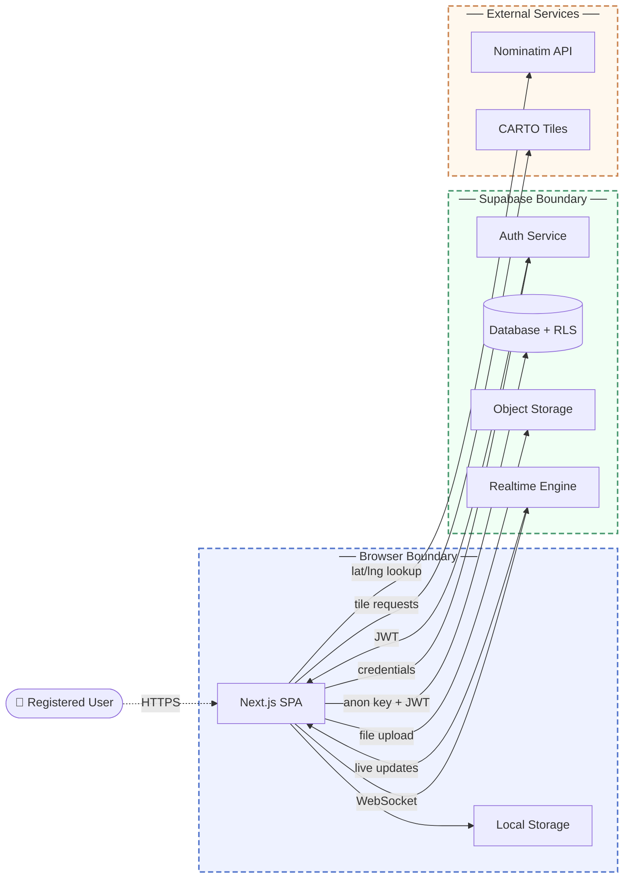

# Whiskr Threat Model

## 1. Overview

Whiskr is a community cat-tracking web application that lets registered users report, map, and coordinate rescues for stray, missing, injured, and colony cats in their area. It is a Next.js single-page application backed entirely by Supabase for authentication, data persistence, file storage, and real-time updates.

Main components:

- Next.js SPA: client-side React application running in the browser; contains all UI logic, direct Supabase calls, and client-side session management
- Supabase Auth: email/password authentication and JWT issuance
- Supabase Database: PostgreSQL with PostgREST API; stores reports, votes, profiles, saved reports, and reporter contact information; access governed by Row-Level Security (RLS) policies
- Supabase Storage: public object storage buckets for cat report photos and user avatars
- Supabase Realtime: WebSocket change feed delivering live report updates to connected clients
- Nominatim (OpenStreetMap): external reverse geocoding API called directly from the browser
- CARTO: external tile CDN supplying base map imagery

This model covers the browser-to-Supabase trust boundary, the authorization model enforced by RLS and RPCs, and the information flows to external services.

## 2. Trust boundaries

- **Browser Boundary**: The Next.js SPA, the Supabase anon key, and all client-side state run inside the user's browser. This zone is fully attacker-controlled; client-side session checks are UI conveniences only. Enforcement: none at this layer.
- **Supabase Boundary**: Authentication, the PostgREST database API, object storage, and the realtime engine form a single backend zone. The SPA trusts Supabase Auth to issue valid JWTs after credential verification, and the database trusts JWT claims to identify the caller. Enforcement: Supabase-signed JWTs and RLS policies govern all table access; privileged rescue operations (accept, complete, release) are gated behind server-side RPCs.
- **External Services**: Nominatim and CARTO are called directly by the browser with no authentication and no response integrity check. Enforcement: none (outbound calls only).

## 3. Threat scenarios

**Reporter contact information exfiltration**
A registered attacker bypasses the application UI and queries the `report_contacts` table directly via the PostgREST API using a valid JWT. If RLS on this table does not restrict reads to the specific rescuer who has accepted the associated report, any authenticated user can retrieve every reporter's email address or phone number in bulk, regardless of whether they are involved in any rescue.

- Risk: Medium likelihood, High impact
- Mitigation: Enforce RLS on `report_contacts` so rows are readable only within the execution context of the `accept_rescue` RPC and by the specific user whose `rescuer_id` matches the parent report, with no broader SELECT grant to the authenticated role.
- Validation: Pentest: authenticate as a user who has not accepted any rescue and attempt a direct SELECT against `report_contacts`; confirm all rows are rejected by RLS.

**Unauthenticated vote flooding and report manipulation**
The Supabase anon key is embedded in the browser bundle and is publicly visible. Any network-capable caller can use it to invoke the PostgREST API directly and insert votes without an authenticated session, bypassing the UI's client-side single-vote gate. At scale this can saturate reports with fabricated "still here" or "not here" signals, undermining the community confirmation system that drives report staleness logic.

- Risk: High likelihood, Medium impact
- Mitigation: Add an RLS insert policy on the `votes` table requiring `auth.uid() IS NOT NULL`, and enforce a per-user-per-report uniqueness constraint at the database level so duplicate votes cannot be inserted even by authenticated users.
- Validation: Automated test: POST a vote to the Supabase REST endpoint using only the anon key with no Authorization header and confirm the request is rejected; separately confirm that two authenticated inserts for the same user and report ID fail the uniqueness constraint.

**Rescue workflow state hijacking**
An authenticated user calls `accept_rescue`, `complete_rescue`, or `release_rescue` on a report they did not legitimately claim. If the RPCs do not verify that the caller's identity matches the report's assigned rescuer before allowing state transitions, an attacker can accept another user's in-progress rescue to obtain reporter contact details, mark active reports as completed without performing a rescue, or forcibly release a rescue mid-operation to disrupt a volunteer.

- Risk: Medium likelihood, High impact
- Mitigation: Implement `auth.uid()` checks inside each RPC so that `complete_rescue` and `release_rescue` abort with an error when the caller does not match `rescuer_id`, and `accept_rescue` rejects calls on reports already in `rescue_accepted` status.
- Validation: Pentest: with two test accounts, have Account A accept a rescue, then invoke `complete_rescue` and `release_rescue` from Account B; confirm both RPCs return an authorization error and leave the report state unchanged.

**Account takeover via credential stuffing**
The login form submits email and password directly to Supabase Auth from the browser with no application-level rate limiting or bot detection. An attacker with a breached credential list can test pairs against the auth endpoint at high volume. A successful match yields full account access, including the ability to impersonate the victim as a reporter, accept rescues on their behalf, and access their bookmarked reports.

- Risk: Medium likelihood, High impact
- Mitigation: Enable Supabase Auth's built-in rate limiting on authentication endpoints and integrate a CAPTCHA provider on the sign-in and sign-up flows to raise the cost of automated login attempts.
- Validation: Configuration audit: verify that rate limits and CAPTCHA are active in the Supabase project Auth settings; pentest: confirm that rapid sequential failed login attempts are throttled before the tenth attempt.

## 4. Architectural fragilities

**Single-layer authorization with no server-side backstop**

The entire authorization model rests on Supabase RLS policies evaluated at the database layer. There are no Next.js API routes, server middleware, or server-side session checks sitting between the user and the database; every sensitive data operation is a direct browser-to-PostgREST call authenticated only by a publicly visible anon key plus an optional JWT. A single permissive or absent RLS policy on any sensitive table exposes that data to all authenticated users, or in some cases all callers, with no secondary control to detect or block the access. The blast radius is elevated by the fact that the anon key is always public and the PostgREST schema is fully introspectable, making it straightforward for an attacker to enumerate table names and attempt direct queries without ever touching the application UI.

**Note that these issues have already been talen care of**
